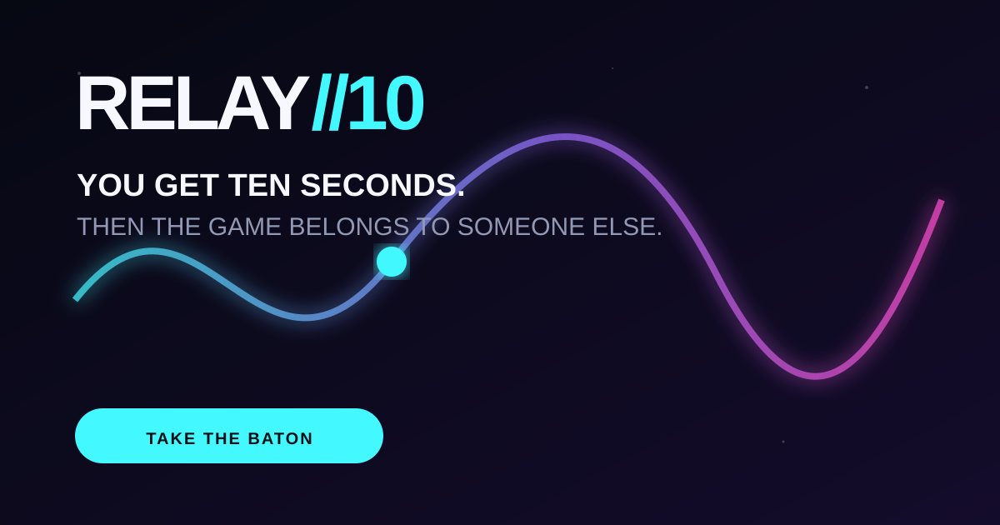

<p align="center">
  
</p>

# RELAY//10

**You get ten seconds. Then the game belongs to someone else.**

RELAY//10 is a mobile-first browser survival game whose handoff link is the baton. Carry a
neon signal through ten seconds of static, choose a gift for the next runner, and share the
exact bounded run state. The recipient continues the same deterministic obstacle field—no
account, lobby, database, or simultaneous connection required.

[Play RELAY//10](https://dean00dev.github.io/RELAY10/) ·
[Read the design](docs/DESIGN.md) ·
[See the research notes](docs/RESEARCH.md)

## Why this is different

Most game share buttons describe something that already happened. In RELAY//10, sharing is
the move that advances the run.

- **Ten-second legs:** the promise is legible before anyone presses Play.
- **Serverless asynchronous relay:** state travels in the URL fragment.
- **One-finger first:** drag anywhere to steer; keyboard controls remain available.
- **Daily and open seeds:** compete on a common field or begin a new chain.
- **Handoff gifts:** restore energy, attract sparks, or calm the next leg.
- **Procedural audiovisuals:** Canvas and Web Audio; no downloaded art or audio bundle.
- **No runtime dependencies:** static HTML, CSS, and JavaScript modules.

## Run locally

ES modules require an HTTP origin rather than opening `index.html` directly:

```bash
python3 -m http.server 8080
```

Then open `http://localhost:8080`.

## Verify

Node 20 or later is used only for development checks; the game itself has no Node runtime.

```bash
npm test
npm run check
```

The tests cover deterministic seeds and obstacle chunks, state round-trips, corruption
detection, strict input bounds, one-time gifts, monotonic cumulative results, bounded relay
history, and share receipts.

## State and trust boundary

The baton is encoded after `#r=` in the URL fragment. Browsers do not send fragments in HTTP
requests, but the full link is visible to anyone a player shares it with and may be retained
by browser history, screenshots, clipboard managers, or messaging services.

Incoming state is schema-checked and size-bounded before use. Its FNV-1a checksum detects
accidental link damage; it is **not authentication, anti-cheat, confidentiality, or proof of
a score**. There is no authoritative leaderboard in this release. See [SECURITY.md](SECURITY.md).

## Accessibility

- pointer, touch, arrow-key, and WASD steering;
- persistent high-contrast HUD and labelled controls;
- reduced-motion control plus system preference support;
- sound is off by default and never carries gameplay-only information;
- automatic pause when the page loses visibility.

The ten-second timed mechanic remains a material accessibility limitation. A future untimed
route-planning mode should be evaluated separately rather than described as present today.

## Status

`v0.1.0-alpha.1` is a public-playtest candidate. It proves the client-side relay mechanism
and core game loop. It does not prove retention, virality, cheat resistance, large-device
compatibility, or production-scale accessibility.

## Authorship

RELAY//10 was conceived and directed by **Dean Egan** and built through an AI-assisted
design, implementation, and hostile-verification workflow.

MIT licensed. See [LICENSE](LICENSE).
